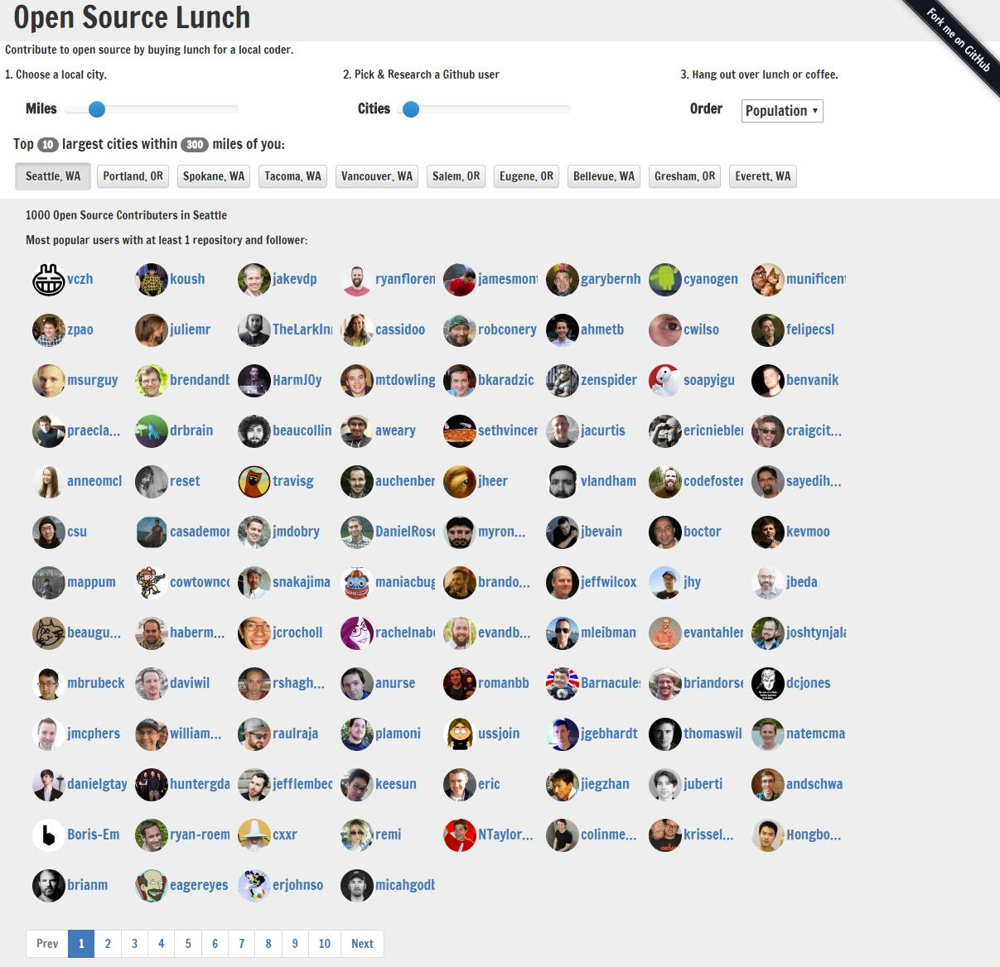

<h1>Open Source Lunch</h1>

Thank and open source developer by buying him lunch. Use this tool to explore Github users local to your region.

Live demo: <a href="https://stuartzahn.net/open-source-lunch/#">https://stuartzahn.net/open-source-lunch/#</a>

TODO:
* Add SSL Cert
* Suport non US cities
* Optimize performance
